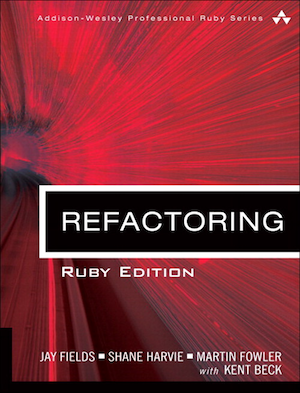

[](https://gitpitch.com/enogrob/ebook-refactoring/master)
```
Roberto Nogueira  
BSd EE, MSd CE
Solution Integrator Experienced - Certified by Ericsson
```
# eBook Refactoring



**About**

Learn everything you need to about the subject of this `eBook` project.

[Homepage](http://www.informit.com/store/refactoring-ruby-edition-ruby-edition-9780321984135)

## Topics
```
[x] Foreword
[x] Preface
[x] Acknowledgments
[x] About the Authors

Chapter 1: Refactoring, a First Example
[ ] The Starting Point
[ ] The First Step in Refactoring
[ ] Decomposing and Redistributing the Statement Method
[ ] Replacing the Conditional Logic on Price Code with Polymorphism
[ ] Final Thoughts

Chapter 2: Principles in Refactoring
[ ] Where Did Refactoring Come From?
[ ] Defining Refactoring
[ ] Why Should You Refactor?
[ ] When Should You Refactor?
[ ] Why Refactoring Works
[ ] What Do I Tell My Manager?
[ ] Indirection and Refactoring
[ ] Problems with Refactoring
[ ] Refactoring and Design
[ ] It Takes A While to Create Nothing
[ ] Refactoring and Performance
[ ] Optimizing a Payroll System

Chapter 3: Bad Smells in Code
[ ] Duplicated Code
[ ] Long Method
[ ] Large Class
[ ] Long Parameter List
[ ] Divergent Change
[ ] Shotgun Surgery
[ ] Feature Envy
[ ] Data Clumps
[ ] Primitive Obsession
[ ] Case Statements
[ ] Parallel Inheritance Hierarchies
[ ] Lazy Class
[ ] Speculative Generality
[ ] Temporary Field
[ ] Message Chains
[ ] Middle Man
[ ] Inappropriate Intimacy
[ ] Alternative Classes with Different Interfaces
[ ] Incomplete Library Class
[ ] Data Class
[ ] Refused Bequest
[ ] Comments
[ ] Metaprogramming Madness
[ ] Disjointed API
[ ] Repetitive Boilerplate

Chapter 4: Building Tests
[ ] The Value of Self-Testing Code
[ ] The Test::Unit Testing Framework
[ ] Developer and Quality Assurance Tests
[ ] Adding More Tests

Chapter 5: Toward a Catalog of Refactorings
[ ] Format of the Refactorings
[ ] Finding References

Chapter 6: Composing Methods
[ ] Extract Method
[ ] Inline Method
[ ] Inline Temp
[ ] Replace Temp with Query
[ ] Replace Temp with Chain
[ ] Introduce Explaining Variable
[ ] Split Temporary Variable
[ ] Remove Assignments to Parameters
[ ] Replace Method with Method Object
[ ] Substitute Algorithm
[ ] Replace Loop with Collection Closure Method
[ ] Extract Surrounding Method
[ ] Introduce Class Annotation
[ ] Introduce Named Parameter
[ ] Remove Named Parameter
[ ] Remove Unused Default Parameter
[ ] Dynamic Method Definition
[ ] Replace Dynamic Receptor with Dynamic Method Definition
[ ] Isolate Dynamic Receptor
[ ] Move Eval from Runtime to Parse Time

Chapter 7: Moving Features Between Objects
[ ] Move Method
[ ] Move Field
[ ] Extract Class
[ ] Inline Class
[ ] Hide Delegate
[ ] Remove Middle Man

Chapter 8: Organizing Data
[ ] Self Encapsulate Field
[ ] Replace Data Value with Object
[ ] Change Value to Reference
[ ] Change Reference to Value
[ ] Replace Array with Object
[ ] Replace Hash with Object
[ ] Change Unidirectional Association to Bidirectional
[ ] Change Bidirectional Association to Unidirectional
[ ] Replace Magic Number with Symbolic Constant
[ ] Encapsulate Collection
[ ] Replace Record with Data Class
[ ] Replace Type Code with Polymorphism
[ ] Replace Type Code with Module Extension
[ ] Replace Type Code with State/Strategy
[ ] Replace Subclass with Fields
[ ] Lazily Initialized Attribute
[ ] Eagerly Initialized Attribute

Chapter 9: Simplifying Conditional Expressions
[ ] Decompose Conditional
[ ] Recompose Conditional
[ ] Consolidate Conditional Expression
[ ] Consolidate Duplicate Conditional Fragments
[ ] Remove Control Flag
[ ] Replace Nested Conditional with Guard Clauses
[ ] Replace Conditional with Polymorphism
[ ] Introduce Null Object
[ ] Introduce Assertion

Chapter 10: Making Method Calls Simpler
[ ] Rename Method
[ ] Add Parameter
[ ] Remove Parameter
[ ] Separate Query from Modifier
[ ] Parameterize Method
[ ] Replace Parameter with Explicit Methods
[ ] Preserve Whole Object
[ ] Replace Parameter with Method
[ ] Introduce Parameter Object
[ ] Remove Setting Method
[ ] Hide Method
[ ] Replace Constructor with Factory Method
[ ] Replace Error Code with Exception
[ ] Replace Exception with Test
[ ] Introduce Gateway
[ ] Introduce Expression Builder

Chapter 11: Dealing with Generalization
[ ] Pull Up Method
[ ] Push Down Method
[ ] Extract Module
[ ] Inline Module
[ ] Extract Subclass
[ ] Introduce Inheritance
[ ] Collapse Heirarchy
[ ] Form Template Method
[ ] Replace Inheritance with Delegation
[ ] Replace Delegation with Hierarchy
[ ] Replace Abstract Superclass with Module

Chapter 12: Big Refactorings
[ ] The Nature of the Game
[ ] Why Big Refactorings Are Important
[ ] Four Big Refactorings
[ ] Tease Apart Inheritance
[ ] Convert Procedural Design to Objects
[ ] Separate Domain from Presentation
[ ] Extract Hierarchy

Chapter 13: Putting It All Together
[ ] References
```
